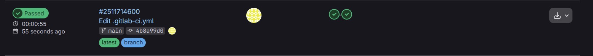
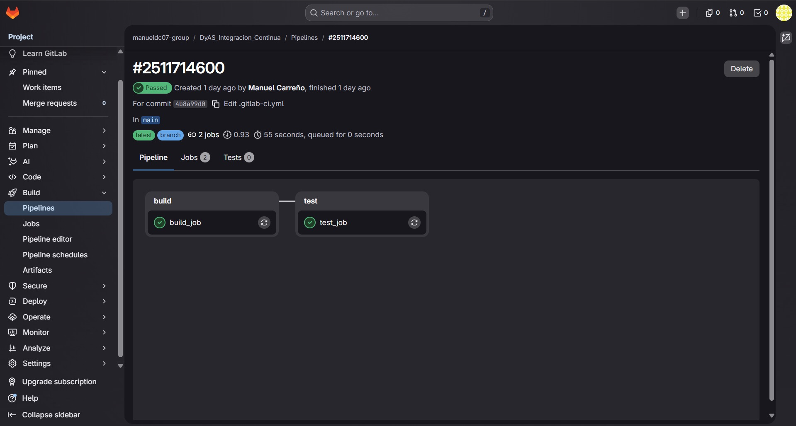
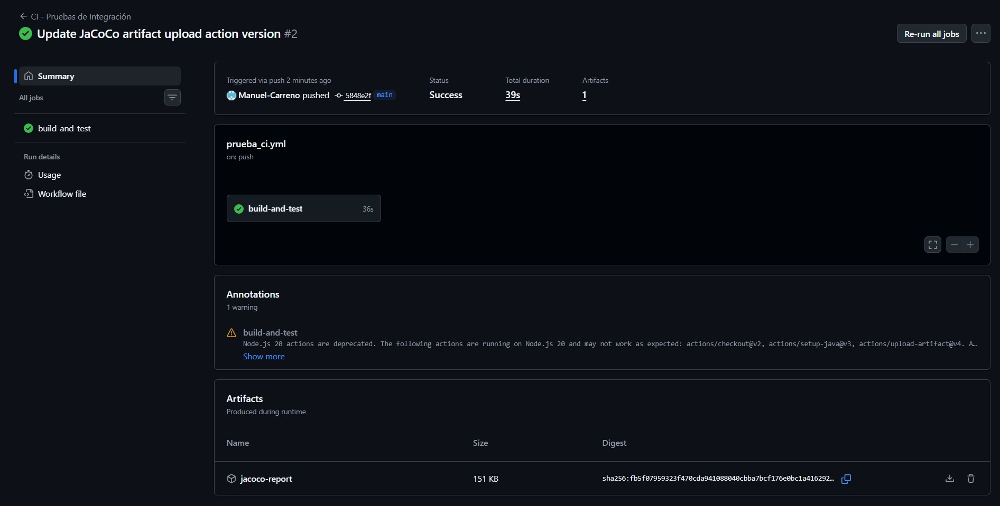
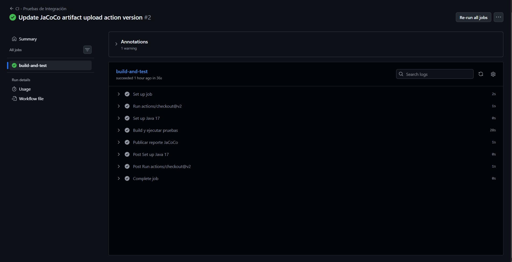
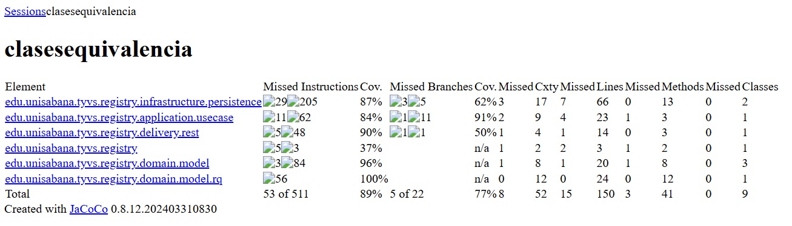

# Taller de GitLab CI: Configuración de un Pipeline de Integración Continua

### Integrantes del equipo

| Nombre | Correo institucional |
|--------|----------------------|
| Juanita Parra | juanitapasu@unisabana.edu.co |
| Alejandro Parra | alejandropaga@unisabana.edu.co |
| Esteban Sequeda | estebansequeda@unisabana.edu.co |

Este taller te guiará paso a paso para configurar un pipeline de Integración Continua (CI) utilizando GitLab CI. Aprenderás a crear un proyecto en GitLab, agregar un archivo de configuración `.gitlab-ci.yml`, y verificar la ejecución del pipeline.

## Contenido de este repositorio

Además de esta guía, en la raíz del proyecto encontrarás:

| Elemento | Descripción |
|----------|-------------|
| `img/` | Evidencias del taller en formato **JPEG** (`img1.jpg` … `img5.jpg`). |
| `.github/workflows/ci.yml` | Ejemplo de CI con **GitHub Actions**: jobs `build` y `test` en cada `push` y *pull request* (útil si el curso también trabaja con GitHub). |
| `run_test/README.MD` | Ejemplos de script `run_tests.sh` para Node, Python, Java/Maven, Ruby y PHP. |
| `github/README.MD` | Guía paso a paso para configurar GitHub Actions. |

Si usas el job de GitLab que llama a `./run_tests.sh`, incluye ese script en el commit, por ejemplo: `git add .gitlab-ci.yml run_tests.sh`.

---

## Paso 1: Crear un Proyecto en GitLab

1. **Iniciar Sesión en GitLab:**

   - Accede a tu cuenta de GitLab o regístrate si no tienes una.

2. **Crear un Nuevo Proyecto:**

   - En el panel de control, haz clic en "New Project" (Nuevo Proyecto).
   - Selecciona "Create blank project" (Crear proyecto en blanco).
   - Asigna un nombre al proyecto y configura la visibilidad según tus necesidades (pública o privada).
   - Haz clic en "Create project" (Crear proyecto).

## Paso 2: Agregar el Archivo `.gitlab-ci.yml`

1. **Crear el Archivo de Configuración:**

   - En el repositorio del proyecto, crea un nuevo archivo llamado `.gitlab-ci.yml`.

2. **Definir el Pipeline en `.gitlab-ci.yml`:**

   - Agrega el siguiente contenido al archivo para configurar un pipeline básico con etapas de build y test:

     ```yaml
     stages:
       - build
       - test

     build_job:
       stage: build
       script:
         - echo "Building the project..."

     test_job:
       stage: test
       script:
         - echo "Running tests..."
         - ./run_tests.sh
     ```

   - Este archivo define dos etapas: `build` y `test`, y dos jobs que se ejecutarán en esas etapas.

## Paso 3: Commit y Push

1. **Realizar un Commit del Archivo:**

   - Guarda el archivo `.gitlab-ci.yml` y realiza un commit en tu repositorio.
   - Si estás utilizando la interfaz web de GitLab, puedes agregar un mensaje de commit y hacer clic en "Commit changes" (Confirmar cambios).

2. **Push al Repositorio (si estás usando Git localmente):**

   - Si estás trabajando en tu máquina local, usa los siguientes comandos para realizar un commit y un push de los cambios:

     ```sh
     git add .gitlab-ci.yml
     git commit -m "Add GitLab CI configuration"
     git push origin main
     ```

## Paso 4: Verificar la Ejecución del Pipeline

1. **Ver el Pipeline en GitLab:**

   - Navega a la sección "CI/CD" en el menú lateral del proyecto.
   - Haz clic en "Pipelines" para ver la lista de pipelines ejecutados.

2. **Revisar el Estado del Pipeline:**

   - Observa el estado del pipeline que acabas de crear. Deberías ver que las etapas `build` y `test` se están ejecutando o ya se han completado.
   - Haz clic en el pipeline para ver los detalles de cada job, incluidos los logs de ejecución.

## Resumen

En este taller, has aprendido a:

- Crear un nuevo proyecto en GitLab.
- Configurar un pipeline de CI básico utilizando un archivo `.gitlab-ci.yml`.
- Realizar commit y push de cambios al repositorio.
- Verificar la ejecución del pipeline en GitLab.

La configuración de un pipeline de CI ayuda a automatizar la integración y prueba del código, mejorando la eficiencia y la calidad del desarrollo de software.

---

## Evidencias

Las capturas siguientes están en la carpeta `img/` (formato JPG).





### Evidencias (aplicado a taller de pruebas de integración)

#### Pruebas pasaron correctamente



#### Flujo de las pruebas (build-test)



#### Reporte JaCoCo



El reporte de cobertura que podemos ver en la imagen de arriba fue generado automáticamente por el pipeline de CI definido en **GitHub Actions**, el cual ejecuta **`mvn clean verify`** sobre el taller de pruebas de integración (Registraduría). En cada **push**, las pruebas se ejecutan solas y se genera el reporte. En ese taller, las pruebas que alimentaron el reporte usaron **H2** (base de datos en memoria), **Mockito** (simulación del repositorio y verificación del caso de uso) y pruebas **HTTP** (servidor completo y respuestas del endpoint). El resultado global fue **89%** de cobertura, dentro del mínimo pedido (**80%**).
